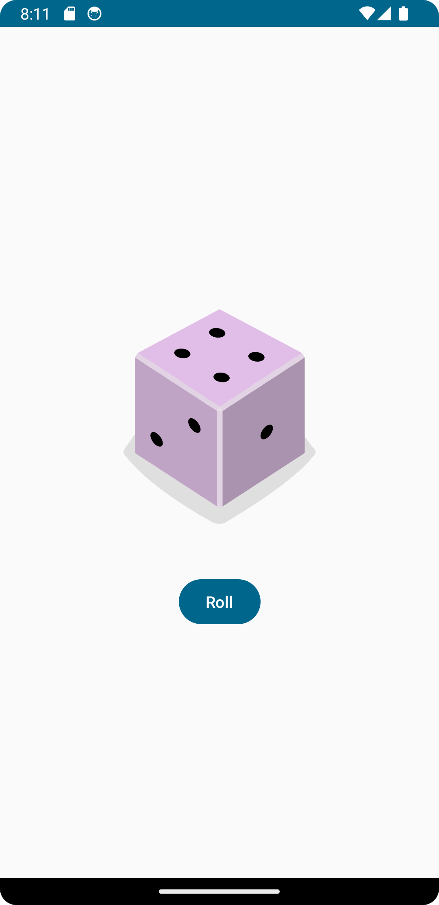
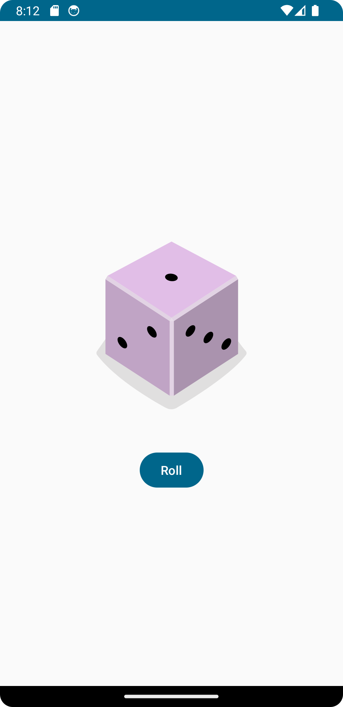

# Dice Roller App

This is a simple Dice Roller app developed as part of the Android Basics with Compose course by Google.

## Features

- Roll a dice to get a random number between 1 and 6.
- Simple and user-friendly interface.
- Built using Jetpack Compose and Kotlin.




## Installation

1. Clone the repository:
   ```bash
   git clone https://github.com/Pranav24k/Dice-Roller.git
